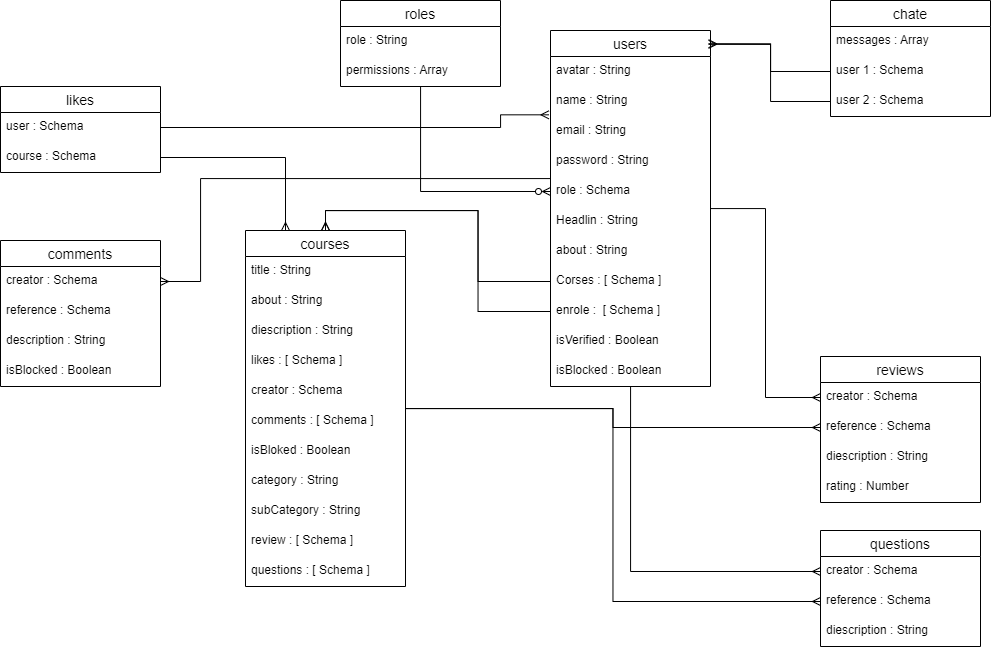
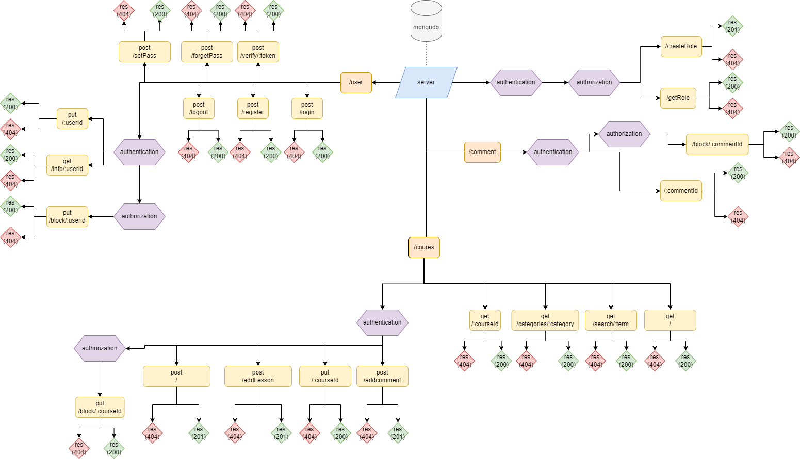

# server

## used library

- [express](https://www.npmjs.com/package/express)
- [cors](https://www.npmjs.com/package/cors)
- [morgan](https://www.npmjs.com/package/morgan)
- [dotenv](https://www.npmjs.com/package/dotenv)
- [mongoose](https://www.npmjs.com/package//mongoose)
- [bcrypt](https://www.npmjs.com/package/bcryptjs)
- [jsonwebtoken](https://www.npmjs.com/package/jsonwebtoken)
- [nodemailer](https://www.npmjs.com/package/nodemailer)

## Models

- users model

| key        | type                | options          | default value |
| ---------- | ------------------- | ---------------- | ------------- |
| name       | String              | required, unique | n/a           |
| email      | String              | required, unique | n/a           |
| password   | String              | required         | n/a           |
| roles      | Schema <Roles>      | required         | n/a           |
| headline   | String              | n/a              | n/a           |
| about      | String              | n/a              | n/a           |
| course     | [ Schema <Course> ] | n/a              | n/a           |
| enrole     | [ Schema <Course> ] | n/a              | n/a           |
| isVerified | Boolean             | n/a              | false         |
| isBocked   | Boolean             | n/a              | false         |

- roles model

| key  | type   | options          | default value |
| ---- | ------ | ---------------- | ------------- |
| role | String | required, unique | n/a           |

- courses model

| key         | type                 | options  | default value |
| ----------- | -------------------- | -------- | ------------- |
| title       | String               | required | n/a           |
| about       | String               | required | n/a           |
| description | String               | required | n/a           |
| creator     | Schema <Users>        | required | n/a           |
| category    | String               | required | n/a           |
| lessons     | [ String ]           | n/a      | n/a           |
| comments    | [ Schema <Comments> ] | n/a      | n/a           |
| reviews     | [ Schema <Reviews> ]  | n/a      | n/a           |
| isBocked    | Boolean              | n/a      | false         |

- comments model

| key         | type               | options  | default value |
| ----------- | ------------------ | -------- | ------------- |
| creator     | Schema <Users>      | required | n/a           |
| description | String             | required | n/a           |
| reference   | Schema <Courses>    | required | n/a           |
| reply       | [ Schema <Replys> ] | n/a      | n/a           |
| isBocked    | Boolean            | n/a      | false         |

- reviews model

| key         | type            | options  | default value |
| ----------- | --------------- | -------- | ------------- |
| creator     | Schema <Users>   | required | n/a           |
| description | String          | required | n/a           |
| rating      | Number          | required | n/a           |
| reference   | Schema <Courses> | required | n/a           |
| isBocked    | Boolean         | n/a      | false         |

- replys model

| key         | type              | options  | default value |
| ----------- | ----------------- | -------- | ------------- |
| creator     | Schema <Users>     | required | n/a           |
| description | String            | required | n/a           |
| reference   | Schema <Comments> | required | n/a           |
| isBocked    | Boolean           | n/a      | false         |

- chats model

| key                             | type                       | options  | default value |
| ------------------------------- | -------------------------- | -------- | ------------- |
| user1                           | Schema <Users>             | required | n/a           |
| user2                           | Schema <Users>             | required | n/a           |
| messages : [{ content, sender}] | [ String, Schema <Users> ] | required | n/a           |

## ER Diagrams

 

## Routes

- User routes
  | HTTP Method | URL | Permissions | Request Body | Success status | Error Status | Description |
  | ----------- | --- | ----------- | ------------ | -------------- | ------------ | ----------- |
  | POST | `/register` | Public | { name, password, email } | 201 | 401 | create new user |
  | post | `/logIn` | Public | { nameOrEmail, password } | 200 | 400, 404 | check if user is exists then return token with user information |
  | POST | `/user/verify/:id` |Public | n/a | 200 | 400 | verifying user account |
  | POST | `/forgetPass` | Public | { email } | 200 | 400 | send reset password link to the user email |
  | POST | `/changePassword` | Private `Authentication` | { newPassword } | 200 | 400 | reset user password to new password |
  | PUT | `/:userId` | Private `Authentication` | { name or headline or about or avatar or password } | 200 | 400 | change user info or password or avatar |
  | GET | `/info/:userid` | Private `Authentication` | n/a | 200 | 400 | get user information |
  | PUT | `/block/:courseId` | Private `Authentication & Authorization` | n/a | 200 | 400 | block a user by id |

- Role routes
  | HTTP Method | URL | Permissions | Request Body | Success status | Error Status | Description |
  | ----------- | --- | ----------- | ------------ | -------------- | ------------ | ----------- |
  | POST | `/createRole` | Private `Authentication & Authorization` | { role } | 201 | 400 | create new role |
  | GET | `/getRole` | Private `Authentication & Authorization`| n/a | 200 | 400 | show all role in the database |

- Course routes
  | HTTP Method | URL | Permissions | Request Body | Success status | Error Status | Description |
  | ----------- | ---- | ---------- | ------------ | -------------- | ------------ |------------ |
  | GET | `/` | Public | n/a | 200 | 400 | get all courses |
  | POST | `/` | Private `Authentication` | { Title, About, Description } | 201 | 400 | create new course |
  | GET | `/search/:term` | Public | n/a | 200 | 400 | get courses by search term |
  | GET | `/category/:category` | Public | n/a | 200 | 400 | get courses by category |
  | GET | `/:courseId` | Public | n/a | 200 | 400 | get courses by id |
  | PUT | `/:courseId` | Private `Authentication` | { title or about or description } | 200 | 400 | update a course |
  | POST | `/addLesson` | Private `Authentication` | { courseId, lesson } | 201 | 400 | add new lesson to a course |
  | PUT | `/block/:courseId` | Private `Authentication & Authorization` | n/a | 200 | 400 | block a course by id |

- Comments routes
  | HTTP Method | URL | Permissions | Request Body | Success status | Error Status | Description |
  | ----------- | --- | ----------- | ------------ | -------------- | ------------ | ----------- |
  | POST | `/` | Private `Authentication` | {creator, description, reference } | 201 | 400 | add comment to course |
  | GET | `/:commentId` | Private `Authentication` | n/a | 200 | 400 | get comment by id |
  | PUT | `/block/:commentId` | Private `Authentication & Authorization` | n/a | 200 | 400 | block a course by id |

- Replys routes
  | HTTP Method | URL | Permissions | Request Body | Success status | Error Status | Description |
  | ----------- | --- | ----------- | ------------ | -------------- | ------------ | ----------- |
  | POST | `/` | Private `Authentication` | {creator, description, reference } | 201 | 400 | replt to a comment |
  | GET | `/:replyId` | Private `Authentication` | n/a | 200 | 400 | get reply by id |
  | PUT | `/block/:replyId` | Private `Authentication & Authorization` | n/a | 200 | 400 | block a reply by id |

- Chats routes
  | HTTP Method | URL | Permissions | Request Body | Success status | Error Status | Description |
  | ----------- | --- | ----------- | ------------ | -------------- | ------------ | ----------- |
  | POST | `/` | Private `Authentication` | { sender, receiver, content } | 201 | 400 | send message from user to another |
  | GET | `/:chatId` | Private `Authentication` | n/a | 200 | 400 | get chat by id |
  | GET | `/user/:userId` | Private `Authentication` | n/a | 200 | 400 | get all user's chats for hem |

## UML Diagrams

 

## Links

### Git

[Client repository Link](https://github.com/MB-Project-Mohammed-Almuziny/client)

[Server repository Link](https://github.com/MB-Project-Mohammed-Almuziny/server)

[Deployed App Link](http://heroku.com/)

### Trello

[Link to trello board](https://trello.com/mbprojectmohammedalmuziny)
